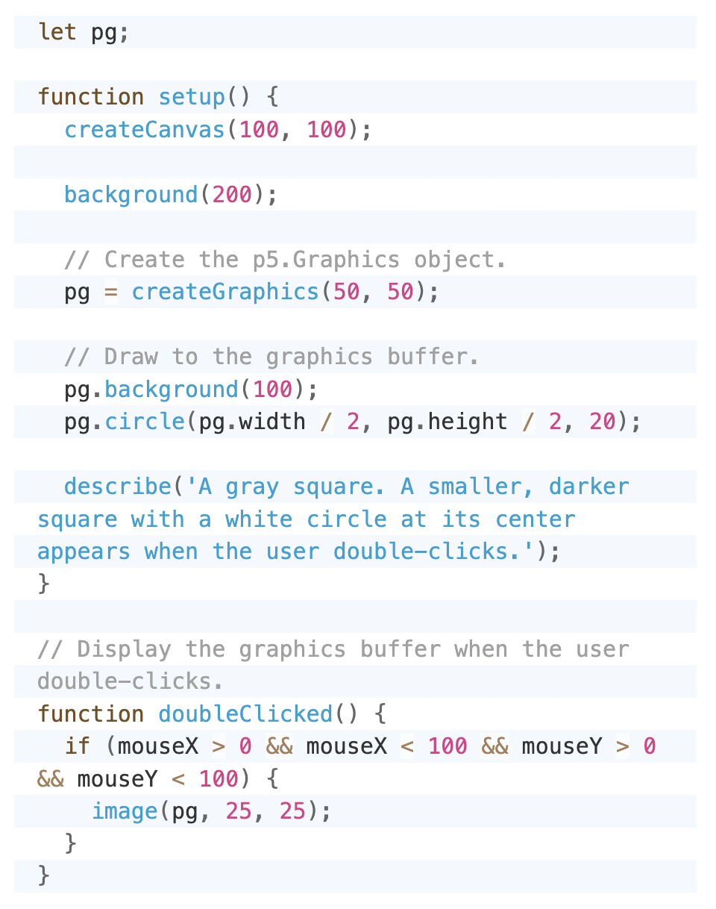

# Individual Work: See Yourself as the Wind
>
## Instructions on how to interact with the work
>
Hello, here's Yuchen. I'll briefly give some instructions here.
>
This individual work includes three amination projects based on the group work of the apple tree. The three works are:
1. snowing
2. disappeared apples
3. perpetual snowing ground
>
When you open the sketch file, you'll see the sketch in the middle of the screen, and the first animation, snowing, is running. Imagine your mouse as wind and attempt to move it horizontally or vertically. You'll see how the snow changes its way under your control. 
>
Meanwhile, try to click the key "d" or "D", and you can see one random apple disappeared. Please attempt to keep clicking it until there's no more reaction. This is for the second animation.
>
After all apples/circles disappeared (i.e., you've clicked the key d or D 36 times), the third animation: perpetual snowing ground will automatically display. You can press the space key simultaneously to accelerate the superposition. 
>
## Details of animating the group code

### Description:
>
I choose *interaction* as the animation method. These are done by incorporating mouse and keyboard inputs. 
>
#### Animation 1: Snow
In the first animation *snowing*, no specific elements in the image are animated. Instead, I transferred all elements in the sketch done in the group work into the background (see technical explanation below) to ensure snowing can run normally. Inspired by the [*Parallax Dots*](https://happycoding.io/tutorials/p5js/creating-classes/parallax-dots) in Happy Coding, I created a `class` for dots representing snow. In the class, I connected the movement of snow with the mouse's X position, so the further away the mouse is from the image, the faster the snow falls. Snow dots that fall out of the scope will re-emerge from the other side, controlled by conditionals `If-else`. I set the bottom limit as height / 1.18, the position of the ground in the sketch, to simulate the disappearance of snow when falling on the ground in reality. Meanwhile, I set 4 layers to make snow dots different in size and an index that can loop 500 times in `setup()`, which makes snowing more vivid. The class was run through the `for...of` loops in `snowMove()`in `draw()`.
>
Since this animation is controlled by mouse movement, it is different from Yishu's and George's animations in essence. Also, 4 layers, different sizes of snow dots, and the speed change of snow according to the mouse's position make this animation different from other members' works, particularly from Yishu's raining animation, in performance.
>
Reference: [*Parallax Dots*](https://happycoding.io/tutorials/p5js/creating-classes/parallax-dots), Happy Coding.
>

>
#### Animation 2: Disappeared Apples
>
This animation changed apples (circles) in the group sketch, mainly performed as the visual disappearance of circles. By doing this, I put `drawApples()` and `drawTreeBranches()` out of the buffer created before, so all apples and the trunk will persistently re-draw following snow animation. But it's fine. I created a `Boolean` array called `visible` with the same length as the array `circles`. This array records whether each circle is visible, and I set all circles as true initially. Then, in `drawApples()`, I called an index i, which is used to check if each circle drawn by `for...of` loops are visible since for...of loops used to draw circles cannot offer the index of one specific circle. As I've set all circles as true, they are all visible temporarily and contained in the new array `visible`. Next, I called the function `keyPressed()`, in which I created an empty array `remaining` used to store indexes of visible circles. Since they are all visible, they are pushed into the array through `if` and `for...of` loops. Lastly, I selected a random index of the circle and turned it invisible by transferring its Boolean value to false in another `if`, then drew the rest of the visible circles. This process is manually controlled by clicking the key d.
>
Performance: one random apple will disappear when you press d or D. The fast flash of red and green colors in each circle is intentional. Since this animation is related to the first one, in which your mouse represents the wind, and our group considers that the green represents leaves and the red represents the fruit, the flash is simulating a tree in heavy wind and snow, whose leaves are swaying fast. The disappearance of apples means the wind blows apples off gradually.
>
Again, this animation is controlled by the keyboard and will not start without clicking, which is the essential difference from other members' works. Also, this work only focuses on the disappearance of specific elements (circles) in the group sketch.
>
Reference: no reference. Inspired by my brain.
>
#### Animation 3:
>
This animation will persistently add superposing white rectangles on the sketch to represent the idea of the world being gradually buried by heavy snow. It is performed by adding one layer of white rectangle each time from the bottom (the ground of the apple tree) to the top. Therefore, I set several variables to count the current layer, total layers, the current frame, total frames, and the frame when this animation starts. I then set a function called `snowGround()`, in which I used `min` and `map` to know which one is the current layer in the current frame from all layers, so they can be superposed one by one. I then used `for` loops to draw all layers with the set size and color (rectangles). This function is put into the `draw()`. 
>
Since I wanted this animation to be run automatically and manually, I added a conditional in the function `keyPressed()` to enable you to accelerate the superposition by pressing the space key if the animation gets started and isn't finished yet. In addition, since I wanted this animation to start after the end of the second animation, I added a Boolean value to set the variable `startSnowingGround` as false. This value will turn true once the system detects you have pressed d or D 36 times to finish the second animation. To ensure the third animation will start from 0 after the second animation rather than invisibly running all the time, I set `currentLayer` and `manualIncrease` as 0 when the Boolean value turns true.
>
This animation is performed as the accumulation of rectangles with sequential limitations in starting and performing, and this animation can be controlled by the keyboard (the space key). Therefore, this animation strictly follows the assignment guideline that asks me to incorporate mouse and keyboard inputs and is different from other members' works in performance and in essence.
>
Reference: no reference. Inspired by my brain.

### Technical explanation:
>
#### About the buffer:
>
The visually moving effect of animation is produced based on the persistent refreshment of the background. However, our group work drew almost all the elements (the background, apples, tree trunks, ground) on the canvas in `draw()` and used `noLoop()` to make it run only once to achieve a static effect. When doing the individual work, Yishu and I found that animation would be affected by `noLoop()` and stop running. Also, moving the existing elements into `setup()` could not solve this problem. After multiple attempts, Yishu and I tried to transform the group work into a part of the background, which made it unable to influence the operation of animation. We achieved it through method [`createGraphics()`](https://p5js.org/reference/#/p5/createGraphics), which creates an offscreen drawing canvas (graphics buffer) and returns it as a p5.Graphics object. Similarly, when I work on the second animation that changes the tree per se, I put functions `drawApples` and `drawTreeBranches` out of the buffer box to make them refresh every frame following the animation.
>
Reference: [createGraphics()](https://p5js.org/reference/#/p5/createGraphics). p5.js reference.

>
#### For other explanation:
For other explanation of how my individual code works to animate the image and any appropriate references, please see descriptions above.